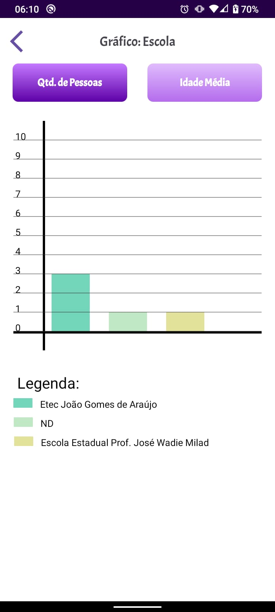
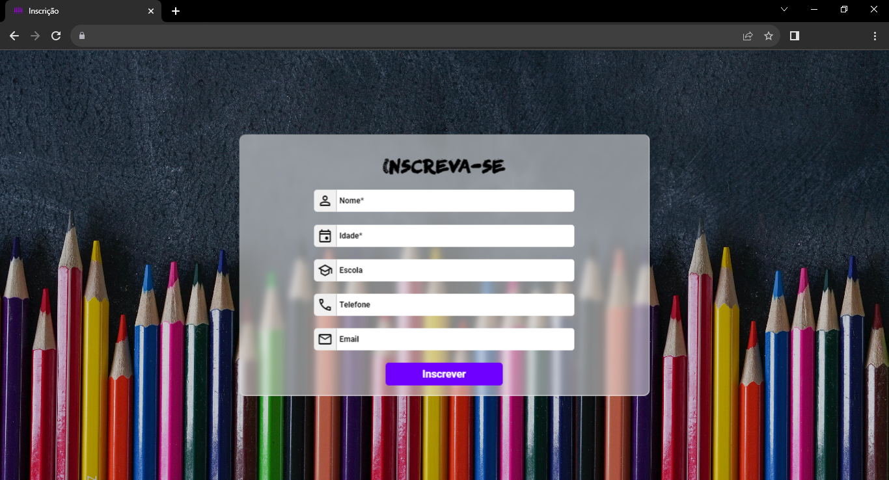
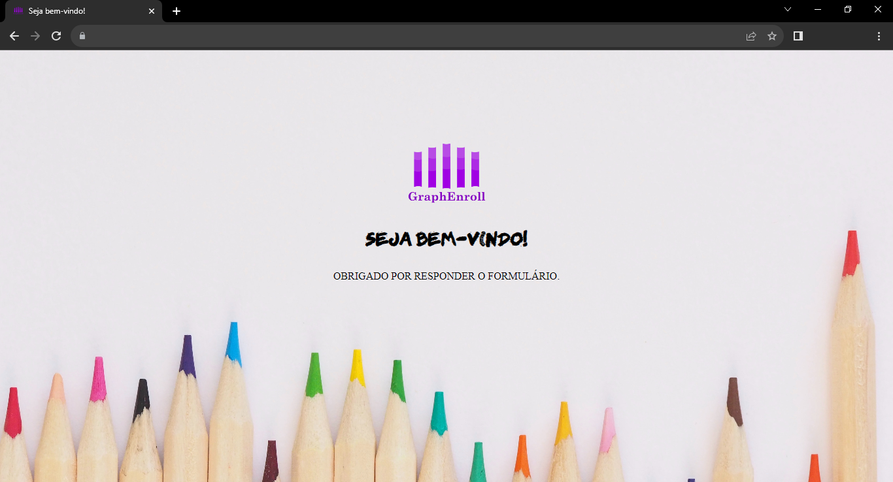

# App - Gerenciamento de Entrada com Firebase

## Sobre

    

        
        
        
        
        
        
    

 

    

        
        
    

 

Este projeto, desenvolvido para a Feira de Oportunidades da ETEC João Gomes de Araújo, tem como propósito capturar e armazenar dados essenciais de um site na plataforma Firebase. Os dados coletados são então utilizados para alimentar um aplicativo desenvolvido no Android Studio, onde são transformados em gráficos de médias, proporcionando uma análise visual detalhada e valiosa.

## Tecnologias utilizadas
<ul>
    <li>Java</li>
    <li>JavaScript</li>
    <li>HTML</li>
    <li>CSS</li>
</ul>

## Implantação
<ul>
    <li>https://neocities.org/</li>
    <li>Banco de Dados: Firebase</li>
</ul>